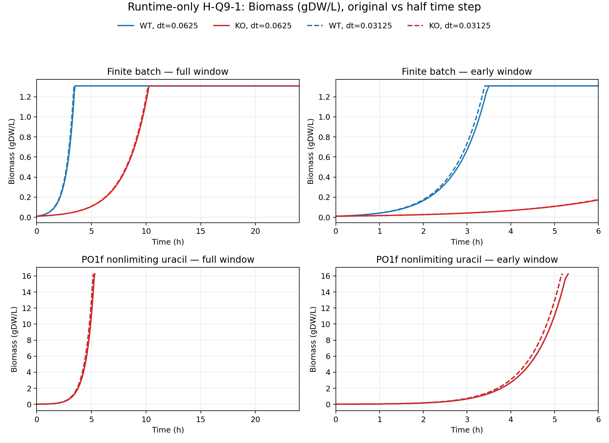
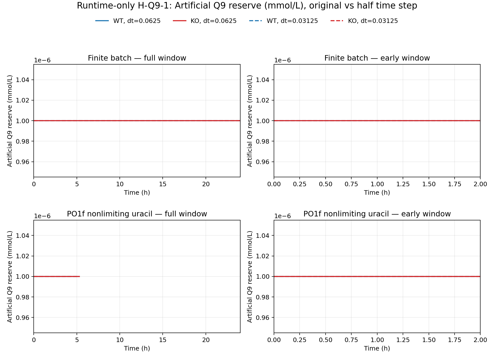

# CoQ9 原始时间步 / 半时间步本地比较

## 范围与结论口径

本次只运行冻结的 runtime-only H-Q9-1 机制；没有修改 `model.xml`、正式 GPR、反应边界、化学计量、curated data 或项目状态。结果是 `sensitivity_only_not_calibrated`，不能据此校准 alpha、CoQ9 储备或判定蛋白的原生功能。

本次 KO 为：

- **YALI1A14736g — no established gene name — uncharacterized protein (model/GPR assignment only; model reaction R305)**。
- **YALI1A21711g — no established gene name — uncharacterized protein (model/GPR assignment only; model reaction R2062)**。

## 八条轨迹完成与终止情况

| run_order | dt_h    | uracil_mode      | gene_id      | termination_status | termination_time_h | advanced_intervals | reserve_enabled_second_solve_attempts | q9_source_positive_intervals | runner_level_solve_attempts | wall_seconds |
| --------- | ------- | ---------------- | ------------ | ------------------ | ------------------ | ------------------ | ------------------------------------- | ---------------------------- | --------------------------- | ------------ |
| 1         | 0.0625  | finite_batch     | WT           | completed          | 24                 | 384                | 328                                   | 0                            | 712                         | 57.7239      |
| 2         | 0.0625  | finite_batch     | YALI1A14736g | completed          | 24                 | 384                | 219                                   | 0                            | 603                         | 44.6037      |
| 3         | 0.0625  | po1f_nonlimiting | WT           | infeasible         | 5.3125             | 85                 | 0                                     | 0                            | 87                          | 7.86279      |
| 4         | 0.0625  | po1f_nonlimiting | YALI1A21711g | infeasible         | 5.3125             | 85                 | 0                                     | 0                            | 87                          | 8.11611      |
| 5         | 0.03125 | finite_batch     | WT           | completed          | 24                 | 768                | 659                                   | 0                            | 1427                        | 117.277      |
| 6         | 0.03125 | finite_batch     | YALI1A14736g | completed          | 24                 | 768                | 441                                   | 0                            | 1209                        | 90.789       |
| 7         | 0.03125 | po1f_nonlimiting | WT           | infeasible         | 5.1875             | 166                | 0                                     | 0                            | 168                         | 15.2948      |
| 8         | 0.03125 | po1f_nonlimiting | YALI1A21711g | infeasible         | 5.1875             | 166                | 0                                     | 0                            | 168                         | 15.6585      |

`nonoptimal` 仅表示冻结约束下求解器未能推进该时间点，不等同于细胞死亡。其后不外推，也不把 terminal row 的无效通量当作生物学读数。

本轮最重要的机制观察是：8 条轨迹的 `q9_source_total_mmol_L` 全部为 0（核对结果：是），人工 Q9 储备始终保持初始 `1e-6 mmol/L`。这证明没有实际储备消耗、没有由储备支持的新增生物量，更没有 Q9 储备耗尽；但不能证明 runner 从未进入储备开放的第二次求解。事实上，部分轨迹的 pFBA 调用数高于推进区间数，与这种第二次尝试相符。这轮比较不能验证储备耗尽机制；两个 KO 在冻结模型中都有不使用储备即可生长的解。

## 同一时间步的 KO/WT 共同观察窗指标

| uracil_mode      | dt_h    | gene_id      | common_observation_end_h | initial_growth_rate_ratio | net_biomass_increment_ratio | biomass_auc_ratio | endpoint_doublings_ratio | endpoint_ratio_reason          |
| ---------------- | ------- | ------------ | ------------------------ | ------------------------- | --------------------------- | ----------------- | ------------------------ | ------------------------------ |
| finite_batch     | 0.0625  | YALI1A14736g | 24                       | 0.328844                  | 1                           | 0.745172          | 1                        | available_full_24h             |
| finite_batch     | 0.03125 | YALI1A14736g | 24                       | 0.328844                  | 1                           | 0.745917          | 1                        | available_full_24h             |
| po1f_nonlimiting | 0.0625  | YALI1A21711g | 5.3125                   | 1                         | 1                           | 1                 | NA                       | KO_or_WT_terminated_before_24h |
| po1f_nonlimiting | 0.03125 | YALI1A21711g | 5.1875                   | 1                         | 1                           | 1                 | NA                       | KO_or_WT_terminated_before_24h |

所有净增长、AUC 与摄取只在同一 mode、同一 dt 的 KO/WT 共同有效窗口内计算。

在 `finite_batch`，YALI1A14736g KO 的初始生长率/WT 为 0.328844；24 h 最终净增量比约为 1.000000，但 AUC 比分别为 0.745172（dt=0.0625）和 0.745917（dt=0.03125）。因此“最终同平台”不能替代整条生长曲线：KO 早期明显变慢，随后在有限尿嘧啶形成的平台处追上 WT。

## 原始步长与半步长比较

| uracil_mode      | gene_id      | unified_common_window_end_h | max_doublings_delta | max_dimensionless_ratio_delta | max_event_time_delta_h | ko_termination_status_match | wt_termination_status_match | ko_q9_depletion_presence_match | wt_q9_depletion_presence_match | diagnostic_pass |
| ---------------- | ------------ | --------------------------- | ------------------- | ----------------------------- | ---------------------- | --------------------------- | --------------------------- | ------------------------------ | ------------------------------ | --------------- |
| finite_batch     | YALI1A14736g | 24                          | 2.39808e-14         | 0.000745411                   | 0.125                  | True                        | True                        | True                           | True                           | False           |
| po1f_nonlimiting | YALI1A21711g | 5.1875                      | 0.177003            | 5.21583e-13                   | 0.125                  | True                        | True                        | True                           | True                           | False           |

两个 dt 的比值在每个 mode 的四条轨迹共同有效窗口 `T* = min(WT粗, KO粗, WT细, KO细)` 上重新计算，不按行号配对，也不把较短轨迹外推到 24 h。预先规定的数值诊断线为：doublings 差 ≤0.01、无量纲比值差 ≤0.001、事件时间差 ≤0.0625 h。超线是数值结果，不会反过来改参数或机制。

表中的 `max_doublings_delta` 是四条轨迹在统一窗口终点 `T*` 的 WT/KO doubling 差之最大值，不是整个时间窗口上逐时刻曲线差的最大值。`max_event_time_delta_h` 同时覆盖 WT/KO 的终止、Q9、glucose 和 uracil exact-zero 事件；缺失事件保持 NA。

事件审计进一步限定了差异来源：

- `finite_batch` WT 在 dt=0.0625 的 24 h 末仍留下 2.76e-15 mmol/L 尿嘧啶数值残差，所以没有 exact-zero 事件；dt=0.03125 在 3.4062 h 记录 exact zero。KO 的尿嘧啶 exact-zero 为 10.375 h 与 10.25 h，相差 0.125 h。有限尿嘧啶而非人工 Q9 储备解释了最终平台。
- `po1f_nonlimiting` 的 WT 与 KO 都在 glucose exact-zero 后终止：dt=0.0625 为 5.3125 h，dt=0.03125 为 5.1875 h，相差 0.125 h；相应 `infeasible` 仅是终止求解事件。

## H-Q9-1 条件上限

H-Q9-1 令 CoQ9 净需求满足 `v_demand = alpha × v_biomass`，初始人工储备为 `Q0 = alpha × B0 × pool`。对“删除后完全不能无储备生长、且新增生物量全部由该储备支持”的理想完全阻断 KO，Euler 预算给出 `ΔQ = alpha × ΔB`，因此 `B/B0 ≤ 1 + pool`。本次 `pool=1`，条件上限是 `B/B0≤2`，即最多 1 次倍增；alpha 在这个预算上限中相消。

这只是施加机制后的数学上限，不证明上述两个未表征蛋白的原生功能，也不保证它们属于完全阻断型 KO；实际轨迹必须连同 source-free growth、终止事件与通量一起解释。

## 曲线

## 可复现性

所有八条轨迹按预注册顺序在一个本地 Python 进程中串行运行；每条从 t=0 加载新的有效模型上下文。Gurobi 显式设置为 `Threads=1, Seed=0, Method=1, FeasibilityTol=1e-9`，实际读回值、软件版本、输入 SHA、逐轨迹 `simulate_gene` wall time 与 runner-level 调用数保存在 `run_manifest.json` 和 `condition_status.tsv`。

计数限制：`runner_level_solve_attempts` 是 runner 对 pFBA 与 fallback `model.optimize` 的调用数，不是 Gurobi 后端实际 LP 优化次数；首次真实执行开始前没有安装底层计数钩子，按“不为补记录重跑”的政策将该字段保留为未知。wall time 只包围 `simulate_gene`，不含每条轨迹之前的模型读取；这些是本次记录缺口，而不是从区间数推算的实测值。
