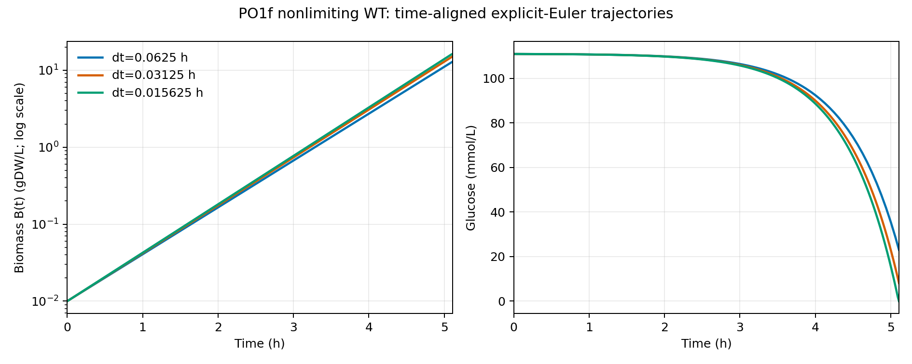

# CoQ9 WT 四分之一时间步诊断

## 范围与结果

本次只新增一条 `po1f_nonlimiting` WT 轨迹：`dt=0.015625 h`、0–6 h、`alpha=1e-4 mmol/gDW`、pool=1、初始 biomass=0.01 gDW/L。冻结的 `simulate_gene`/Euler 内核、模型、培养基和 PO1f profile 未改；Gurobi 仍为 `Threads=1, Seed=0, Method=1, FeasibilityTol=1e-9`。结果仅为 `runtime_only`、`sensitivity_only_not_calibrated`。

| dt_h | valid_endpoint_h | common_horizon_Tstar_h | biomass_at_Tstar_gDW_L | doublings_at_Tstar | biomass_AUC_0_Tstar_gDW_h_L | glucose_exact_zero_h | termination_status | termination_time_h | advanced_intervals |
| --- | --- | --- | --- | --- | --- | --- | --- | --- | --- |
| 0.0625 | 5.3125 | 5.109375 | 12.893902 | 10.332473 | 9.191795 | 5.3125 | infeasible | 5.3125 | 85 |
| 0.03125 | 5.1875 | 5.109375 | 15.075557 | 10.557996 | 10.517792 | 5.1875 | infeasible | 5.1875 | 166 |
| 0.015625 | 5.109375 | 5.109375 | 16.266899 | 10.667724 | 11.287381 | 5.109375 | infeasible | 5.109375 | 327 |

三条有效轨迹的共同窗口为 `T*=5.109375 h`。所有 B、doublings、净增长和 AUC 都在这个共同时间点／窗口重算；没有按行号配对，也没有向终止后外推。新轨迹推进 327 个区间，以 `infeasible` 在 5.109375 h 结束。`infeasible` 是冻结约束下的求解终止，不是细胞死亡证据。

## 两次连续减半

| refinement_pair | coarse_dt_h | fine_dt_h | doublings_abs_delta_at_Tstar | glucose_exact_zero_abs_delta_h | termination_abs_delta_h | termination_status_match | diagnostic_pass |
| --- | --- | --- | --- | --- | --- | --- | --- |
| h_to_h2 | 0.0625 | 0.03125 | 0.2255224 | 0.125 | 0.125 | True | False |
| h2_to_h4 | 0.03125 | 0.015625 | 0.10972796 | 0.078125 | 0.078125 | True | False |

诊断线保持不变：doublings 差 ≤0.01；glucose exact-zero 与 solver termination 的时间差 ≤0.0625 h，并要求终止状态一致。连续指标中，B(T*)、doublings、净增长、AUC 及整条对齐 B(t) 曲线的相邻差是否缩小，分别记录为 `{'biomass_at_Tstar': True, 'doublings_at_Tstar': True, 'net_biomass_increment_at_Tstar': True, 'biomass_AUC_0_Tstar': True, 'max_abs_time_aligned_biomass_curve_delta': True, 'glucose_exact_zero_time': True, 'solver_termination_time': True}`。只有差异非零、明显高于预声明数值噪声且确实缩小时，`refinement_comparison.tsv` 才给出误差比和表观阶数；它们只是细化诊断，不证明算法收敛阶，也不识别唯一误差来源。exact-zero 和终止时间具有网格量化，因此不报告表观阶数。

## 算法含义与边界

当前显式 Euler 更新为 `B_next = B × (1 + mu × dt)`；恒定 `mu` 时，其有效连续增速为 `ln(1+mu×dt)/dt`，所以减小 dt 会改变累计生物量。同时每步底物摄取上限为 `C/(B×dt)`，接近耗尽时 dt 也会改变优化问题本身。因此本轮只能观察连续减半后的总差异，不能把误差唯一归因于 biomass 积分。如果以后改为指数更新，必须同步积分 glucose 等营养物消耗，不能只替换 biomass 公式。

三条 WT 的人工 Q9 source 总用量均为 0；新轨迹 Q9 source 阳性区间为 0，Q9 耗尽事件为 NA。因此这轮没有测试到 Q9 储备耗尽分支，也不能验证 H-Q9-1 的储备机制。

## 运行与声明限制

新轨迹实测 runner-level 调用 329 次；实测 optlang→Gurobi backend optimize 完成调用 656 次；`simulate_gene` wall time 为 29.179 s，总轨道（含 context）为 31.211 s。旧两条轨迹未预装 backend hook，底层调用数保持 NA，不由 pFBA 调用数推算。

本轮只有 WT，没有 KO、没有新增基因讨论、没有全基因组／参数网格、没有 HPCC，也没有修改 model.xml、GPR、bounds、stoichiometry、curated data、FN dossier 或 PROJECT_STATE。历史正例覆盖 322/1612 与交集内 10% recall 67/322 只是冻结背景，本次单条 WT 轨迹不能更新这些数值，也不是独立校准。
