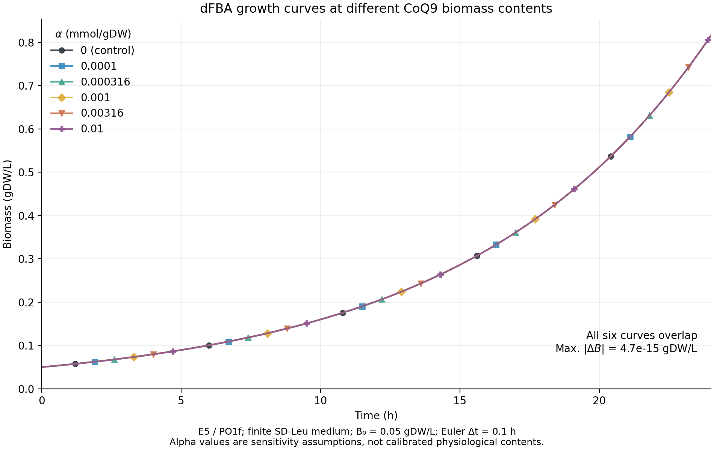

# CoQ9 含量 α 下的实际 dFBA 生长曲线

2026-10-05。按用户澄清，本轮输出生物量随时间变化的曲线。α表示固定的胞内CoQ9生物量含量假设（mmol/gDW），不是培养基中外加CoQ9浓度。

**结果：六条曲线在数值精度内重合。** 生物量从0.05 gDW/L增至24 h的约0.815246 gDW/L；各条增长率均约0.116990143 h⁻¹。任一时间点相对α＝0对照的最大差约4.7×10⁻¹⁵ gDW/L，没有可解析的生长差异。

| α（mmol/gDW） | 24 h生物量（gDW/L） | R385通量（mmol/gDW/h） |
|---:|---:|---:|
| 0（对照） | 0.815246 | 0 |
| 0.0001 | 0.815246 | 0.0000116990 |
| 0.000316228 | 0.815246 | 0.0000369955 |
| 0.001 | 0.815246 | 0.0001169901 |
| 0.003162278 | 0.815246 | 0.0003699553 |
| 0.01 | 0.815246 | 0.0011699014 |

CoQ9需求实际生效：每步都满足 `v_R385＝α·v_biomass_C`，R385下界仍为0；原有生物量系数保持，仅增加 `m468[C_mi]: −α`。曲线重合意味着在本次参数范围和培养条件下，增加该需求没有降低模型的最优生长，不能解释为CoQ在生物上没有成本。

**条件与计算。** 使用固定历史E5及PO1f运行时配置，复用此前dFBA的有限SD-Leu培养基。初始葡萄糖111.014898199 mmol/L；尿嘧啶0.1784280489 mmol/L、摄取上限0.01607 mmol/gDW/h；初始生物量0.05 gDW/L，Euler步长0.1 h，持续24 h。每一步更新培养基库存、应用可用量限制，并用现有pFBA内核重新求解。生长读取 `biomass_C` 通量，不把pFBA总通量目标当作生长率。

六条曲线均实际完成240步，共1440次pFBA、2880次后端LP，耗时约98.8 s；不是将刚才的静态增长率代入指数曲线。预算为3000次LP、1200 s、单线程、每LP上限60 s；未重试、未追加KO/FVA/能量测试。每条保存241个时间点（含0和24 h），逐步完整通量、原始库存值和交换边界也已保存。

**与上一张静态图的差别。** 此dFBA沿用有限尿嘧啶及0.01607摄取上限；上一轮静态测试使用尿嘧啶非限制上限1000，不能直接把两组差异归于时间积分。六条轨迹每步尿嘧啶摄取都达到0.01607上限，与该摄取上限限制增长的解释一致；24 h尿嘧啶仍约0.0733124 mmol/L，因此不能称尿嘧啶已耗尽。本轮未新增放宽摄取上限的反事实测试。

**验证与边界。** α＝0的24 h终点与此前同条件结果一致。模型补丁范围、逐步质量守恒／边界、CoQ池平衡及包装层与内核终点一致性均通过；最大质量平衡残差约1.1×10⁻¹⁴，未触发负值裁剪。有限独立只读核对涵盖5项核心声明（运行身份与完成范围、241点更新／终点、CoQ耦联、曲线重合、失败及数值处理）：5/5支持、未决0、矛盾0；未额外求解，也不构成原生生理或全模型验证。沿用0.1 h Euler方案，未新增步长收敛测试；α仍未生理校准。

未导出新XML、修改默认模型／培养配置文件、合并其他候选、提交或推送。原始E5及旧结果保持。输入完整SHA、实际代码／环境身份、原有dirty状态、参数与预算见[manifest](manifest.json)；未声称重建完整历史环境。

交付：[PNG](dfba_growth_curves.png) · [PDF](dfba_growth_curves.pdf) · [时间曲线数据](growth_curves.tsv) · [端点数据](endpoints.tsv)。运行入口为[run.py](run.py)：项目Python执行完整模拟；`--plot-only`仅读已有数据，可用现有系统Python绘图。运行命令记录在[commands.txt](commands.txt)。
