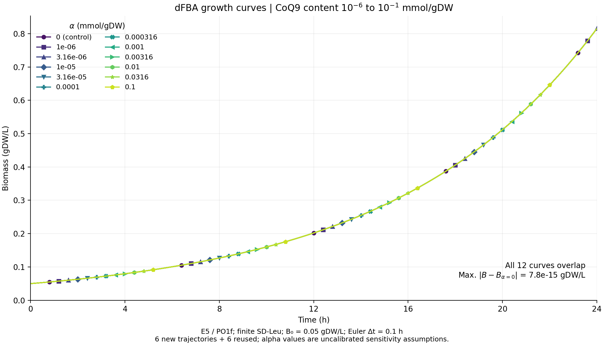

# CoQ9 α＝10⁻⁶–10⁻¹ 的 dFBA 扩展曲线

2026-10-05。本轮按用户要求扩大CoQ9生物量含量α范围：11个正值 `10^(−6+0.5k), k=0…10`，另加α＝0对照，共12条曲线。α单位为mmol/gDW，不是胞外培养基浓度。



**12条曲线仍在数值精度内重合。** 24 h生物量均约0.815246 gDW/L，增长率约0.116990143 h⁻¹；全时程相对零对照最大生物量差约7.8×10⁻¹⁵ gDW/L。

沿用固定E5、PO1f、有限SD-Leu、初始生物量0.05 gDW/L、24 h及0.1 h Euler步长。仅改变 `biomass_C` 中Q9系数，R385边界仍为[0,1000]。本轮新增α＝10⁻⁶、10⁻⁵·⁵、10⁻⁵、10⁻⁴·⁵、10⁻¹·⁵、10⁻¹的6条完整逐步轨迹；原有6条标为“复用既有结果”，未重算。复用前后确认输入／代码指纹及模型、培养基、求解参数、运行条件一致；旧结果未覆盖。

新增6条各240步，共1440次pFBA／2880次LP，约96.1 s，均完成。预算3000次LP／1200 s、单线程、每LP上限60 s；无重试。合并数据共2892个时间点，每条含0和24 h。新轨迹使用原有运行代码及内核，仅指定新α与独立输出位置。

**CoQ需求确实生效。** 各保存步骤均满足 `v_R385＝αμ`。最低α＝10⁻⁶时R385通量为1.16990×10⁻⁷ mmol/gDW/h，未被容差忽略为零；最高α＝0.1时为0.0116990。曲线重合仅说明在这些培养约束下，所测CoQ需求没有降低最优生长，不能说明生物上没有CoQ成本，也未校准α。沿用的尿嘧啶摄取上限0.01607仍达到边界；本轮未改变培养条件或追加瓶颈反事实实验。

独立只读核对4项核心声明，4/4支持：身份及新增／复用来源、执行和时间点完整性、曲线与终点一致性、CoQ耦联及低α数值处理。最大质量平衡残差约2.1×10⁻¹⁴，无失败补零或负值裁剪。核对不新增LP，不构成生理验证；未新增步长、KO、FVA或能量矩阵。未修改默认模型、导出XML、接受候选、提交或推送。

[完整曲线数据](growth_curves.tsv)及[端点表](endpoints.tsv)均含 `evidence_origin`；[manifest](manifest.json)逐曲线记录原始结果／通量位置和完整SHA，区分6条新增与6条复用。[PDF](dfba_growth_curves.pdf)可直接导出。

执行命令（项目根目录）：

```sh
.venv/bin/python -B artifacts/coq_biomass_dfba_extended_20261005/run.py
MPLCONFIGDIR=/tmp/coq_dfba_extended_mpl_20261005 /opt/miniconda3/bin/python -B artifacts/coq_biomass_dfba_extended_20261005/run.py --plot-only
```
