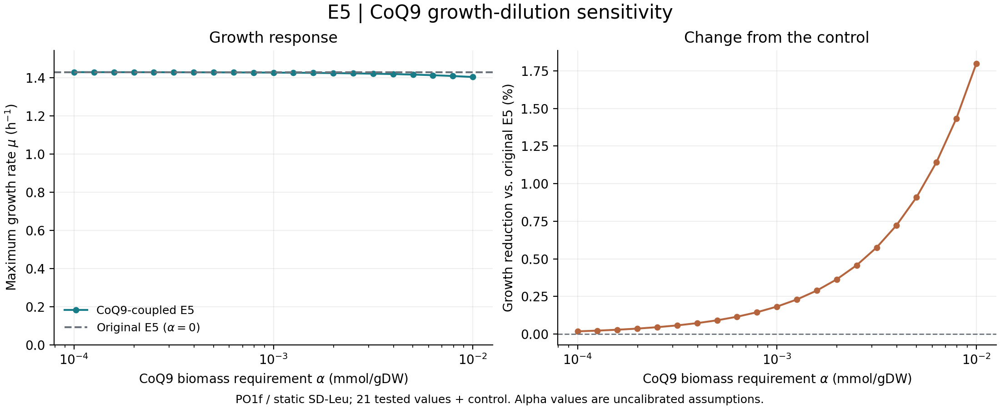

# E5 CoQ9 生物量需求—生长率曲线

2026-10-05，本次实际计算。用户授权 α＝10⁻⁴–10⁻² mmol/gDW 的敏感性测试；取21个对数等距值，加 α＝0 原模型对照。**范围内均能生长，最大生长率随 α 增加而下降，相对对照下降约0.0183%–1.7978%。**

| α（mmol/gDW） | 最大生长率 μ（h⁻¹） | 相对对照生长 | R385通量（mmol/gDW/h） |
|---:|---:|---:|---:|
| 0（原模型） | 1.4291778923 | 100.0000% | 0 |
| 10⁻⁴ | 1.4289162961 | 99.9817% | 0.0001428916 |
| 10⁻³ | 1.4265662325 | 99.8173% | 0.0014265662 |
| 10⁻² | 1.4034838704 | 98.2022% | 0.0140348387 |

**实现与条件。** 输入为固定[历史 E5](../atp_candidate_repair_20260924/candidates/E5.xml)，不是10月2日 CoQ 化学候选或10月5日 R1889 GPR 候选。沿用保存的 PO1f／静态 SD-Leu 条件：葡萄糖摄取上限10 mmol/gDW/h、尿嘧啶为运行时非限制设置1000，NGAM下界7.8625，目标为最大化 `biomass_C`。这与有限培养基时间序列 dFBA 不同。

每个正 α 点仅在内存中的 `biomass_C` 加入 `m468[C_mi]: −α`。原有生物量系数及 R385 的 [0,1000] 边界保持；不新增固定需求或其他供给。总 Q9/Q9H₂ 池由此满足：

\[
v_{R385}-\alpha\,v_{biomass_C}=0.
\]

**验收。** 22个点均为 `optimal`；实际完成22次FBA（1次对照＋21次正 α），不含额外KO、FVA或能量复测。每个优化问题都核对为只有上述系数差异，临时修改随后撤销；源XML保持不变。保存通量中 `v_R385−αμ` 均为0，全系列最大质量平衡残差约1.32×10⁻¹³，低于原定10⁻⁷容差。独立只读核对确认22行汇总与保存通量一致，并核对代表点的计量、边界及图示，未新增优化。

**含义与边界。** 加入生物量稀释项后，正生长伴随正 CoQ9 净合成；在本次范围内，这一需求使模型生长略降，没有导致失去生长。α仍是未校准的假设量，曲线不能确定真实CoQ含量，也不能证明原生末端化学、基因必需性或真实培养生长曲线。本轮未选择正式α、未导出新的候选XML、未合并其他工作线或更改默认模型。

实现过程中先遇到绘图库环境缺失（零求解），随后发现 COBRA 对此前不存在的代谢物使用 `combine=False` 时无法在模型上下文内撤销。共享构建函数改用等价的差值添加，并通过含上下文恢复的软件测试（零求解）。首次已完成的对照保留于 `results/`；完整系列在 `sweep/`，复用对照前逐项确认优化问题完全相同，没有重跑对照。绘图使用本机已有环境并显式载入项目依赖，未新增安装或优化。

完整数值见[数据表](sweep/growth_curve.tsv)，可分享版本见[PDF](sweep/growth_curve.pdf)。输入、实现完整SHA、培养／菌株配置、软件版本及已有dirty状态见[manifest](sweep/manifest.json)；原始优化问题、通量与预算记录同目录保存。使用[运行命令](commands.txt)及[测试入口](../../scripts/test_coq_biomass_growth.py)可复查，历史失败记录未覆盖。未提交或推送。
