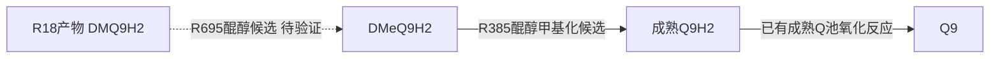

# CoQ 末端反应的酿酒酵母参照

本次找到了 R695 和 R385 的反应级参照，其中末端甲基化的醌醇表示有较明确的酵母实验依据；独立 DMQH2 氧化酶仍未查实。此前把缺口限定为“必须新增一条 DMQH2→DMQ 氧化反应”过于狭窄，还应比较连续醌醇路线。但数据库中存在这条路线，不等于完整 Q9 净反应已经获得验证。

本次工作日期为2026-10-02。实际目标是解脂耶氏酵母 *Yarrowia lipolytica* 的[管线局部候选](../coq_literature_pipeline_20261002/coq_literature_pipeline.xml)，参照物种是主要合成Q6的 *Saccharomyces cerevisiae*。本轮只查找与核验反应，未修改模型、整理规则或默认开关，未运行优化。

## 找到的对应反应

|本模型位置|酿酒酵母反应记录|反应及适用范围|
|---|---|---|
|R695 末端羟化|YeastCyc RXN3O-75|DMQ6H2 + 通用还原供体 + O2 → DMeQ6H2 + 通用氧化供体 + H2O。这是连续醌醇路线的数据库参照；电子供体尚未具体化，不能自动改写为已证实的NADH计量。|
|R385 末端O甲基化|YeastCyc RXN3O-102；EC2.1.1.64|DMeQ6H2 + SAM → Q6H2 + SAH。YeastCyc另列H+，取决于底物微物种；转入本模型时须按实际分子式/电荷配平。|
|成熟QH2氧化|Yeast-GEM r_0439；本模型已有R305|作用于成熟辅酶Q池。不能从成熟QH2的活性推定其能氧化DMQH2。|

DMQ是**去甲氧基**辅酶Q，DMeQ是**去甲基**辅酶Q；两者不同。H2表示醌醇，未带H2表示相应醌。

数据库来源：[酵母CAT5/COQ7](https://pathway.yeastgenome.org/gene?id=YOR125C&orgid=YEAST)、[酵母COQ3](https://pathway.yeastgenome.org/gene?id=YOL096C&orgid=YEAST)、[IUBMB EC2.1.1.64](https://iubmb.qmul.ac.uk/enzyme/EC2/1/1/64.html)。模型反应与化学式由固定文件逐项读取，见[模型对照](yeast_model/REPORT.md)。

## 对应基因及证据

|酿酒酵母系统ID和名称|蛋白功能与证据|解脂耶氏酵母现有候选|
|---|---|---|
|YOR125C — CAT5，别名COQ7|CoQ末端羟化相关蛋白；遗传功能已验证、具体RXN3O-75方程为整理注释，自由醌醇底物净计量未被本轮证据确认|YALI1E18269g — COQ7家族候选，去甲氧基泛醌羟化酶；XP_503973.1；同源/整理注释及既有AlphaFold预测支持，原生催化特异性未验证|
|YOL096C — COQ3|CoQ环O甲基转移酶；酵母线粒体缺失/回补实验支持末步作用与基质侧定位|YALI1B20835g — COQ3家族候选，CoQ环O甲基转移酶；既有同源/整理注释及AlphaFold预测支持，原生正式符号和酶活未验证|

本轮未重新预测结构、运行序列比较或把候选升级为原生实验验证。解脂耶氏酵母对应关系沿用[既有蛋白审查](../coq_system_gpr_review_20260918/coq_gene_gpr_review.tsv)，当前R695已有辅助依赖也没有改动。

## 实验实际支持到哪一步

**R385依据较明确。** Poon等1999使用短链demethyl-Q3类似物和离体酵母线粒体：删除COQ3丢失末步O甲基化，回补恢复；反应依赖NADH。作者将其解释为底物先还原成醌醇，并在检测前用Ce(IV)人为氧化产物。纯化蛋白对预还原底物的直接要求，则来自同文的细菌UbiG实验。它支持末步采用醌醇表示，但不能声称已纯化验证解脂耶氏酵母酶或原生Q9底物。[Poon等1999，Methods、Fig3及Discussion](https://www.biochemistry.ucla.edu/Faculty/CClarke/pdf/21665.pdf)

**R695仍有实质分歧。** IUBMB于2024年将真核羟化净式列为醌底物/NADH的EC1.14.13.253；EC1.14.99.60目前注明为原核醌醇羟化。YeastCyc仍保留后者的醌醇/通用供体表示。现代实验基础主要是人蛋白及重构四足动物祖先蛋白，不能当作酵母的直接底物阴性证据。[当前真核分类](https://iubmb.qmul.ac.uk/enzyme/EC1/14/13/253.html)、[醌醇分类](https://iubmb.qmul.ac.uk/enzyme/EC1/14/99/60.html)

Nicoll等2024在醌与醌醇的比较中监测的是NADH消耗，观察到醌条件的信号；该终点不能排除所有不消耗NADH的醌醇周转。Fig5另有从氧化型底物出发的联合酶GC/MS产物检测，不能概括为整图只测NADH。Lu等2013展示人酶结合态底物介导双铁中心还原，也不足以定义一条可独立加入模型的自由DMQH2氧化反应。[Nicoll等2024 Fig5](https://pmc.ncbi.nlm.nih.gov/articles/PMC7615680/)、[Lu等2013](https://doi.org/10.1021/bi301674p)

**尚无可直接填入的独立氧化GPR。** 本轮也检查了呼吸链和 YLR290C — COQ11（CoQ合成/调节相关蛋白；参与功能有实验支持，氧化还原催化活性未定）。后者文献只提出成熟Q6H2氧化假说，没有确定DMQ底物或电子受体。Padilla等2004观察到DMQ6-only酵母呼吸缺陷，但同时存在bc1装配缺陷；作者明确不能据此区分DMQ是否是功能性bc1底物。因此不能据该结果赋予或否定DMQH2氧化活性。[Bradley等2020 Discussion](https://pmc.ncbi.nlm.nih.gov/articles/PMC7196636/)、[Padilla等2004](https://doi.org/10.1074/jbc.M400001200)

## 可继续审查的连接方案

这条候选把末端甲基化产物接到已存在的成熟Q9H2池，无需预先假定一条独立前体氧化酶。**真正尚未确定的是R695对自由DMQ9H2的适用性、供体及完整净计量。** 改变R385后还必须同步解决它的醌醇底物供给，单改末步不会闭合通路。

另一条机制推演是 DMQ9H2 + O2 → DMeQ9 + H2O：醌醇先为酶双铁中心供电子再羟化。它在元素上可配平，但本轮未找到自由醌醇完整周转实测，且之后仍需解释DMeQ9还原，不能作为现成答案。氧气自氧化同样不能只补一个无电子受体的箭头；产物是水、过氧化氢还是其他氧化还原过程需要证据。

本轮还发现固定Yeast-GEM9.1.1的r_0532用醌底物和醌醇产物，元素守恒而电荷残差为−2；r_0963则为醌→醌。两个模型版本均没有所需独立DMQH2氧化连接。因此推荐优先沿**反应来源与酶学**整理R695/R385，不复制外部模型的整个六基因AND或混合氧化态计量。[实际提取与核验](yeast_model/verification.json)

## 核验范围

本次采用科研治理、ARS快速文献核验和基因身份说明；来源分为原始实验、官方分类、数据库整理与模型文件。主任务6批定向检索共21个查询，原始文献分线6批18个查询；不是系统综述或穷尽搜索。独立审核针对[8条有限声明](CLAIMS.md)，8/8已审，6支持、2未决、0反证、0未核查；未决项是独立氧化酶与完整原生Q9路线，详见[审核报告](source_audit/AUDIT.md)。原始来源定位、获取失败及完整指纹保存在各分线记录及最终MANIFEST；未取得全文的部分不冒称完整阅读。

本轮结论是“找到反应对应及可审候选，R385证据加强，R695完整Q9净反应仍未解决”，不称模型已闭合或已修改。
