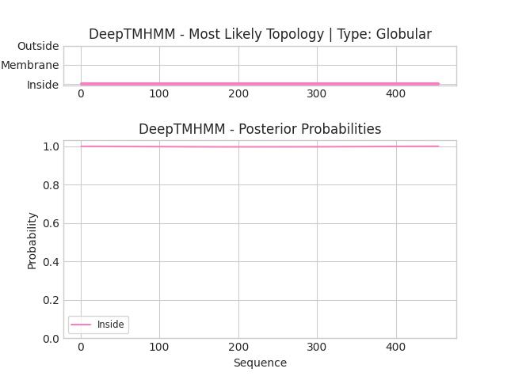

## DeepTMHMM - Predictions
Predicted topologies can be downloaded in [.gff3 format](TMRs.gff3) and [.3line format](predicted_topologies.3line)

You can download the probabilities used to generate this plot [here](YALI1E16433g_W29_AOW05368.1_probs.csv)
### Predicted Topologies
```
>YALI1E16433g_W29_AOW05368.1 | GLOB
MTVDQYPAKAHALKAAQHLKASGASDDALWYIEAAKTTLWPHSDQTVPLRQHRYFYYLTGYEAPDAIVTYSAKDDKITLYIPEIDDEEVMWSGLPLSPEQIRAVSDVDEIKYMNHLESDLKGKKLISVETYDKRDAVTMSQPLLDALDEARAIKDSHELALMRHASEITDNSHLAVMSALPIEKNEGHIHAEFIYHSIRQGSKNQSYDPICCAGTSAGTLHYVKNDLPLDDKLLVLIDAGAEWKNYASDVTRCFPISGEWTKECRDIYEAVLDIQNHCIEKIKPGVNYEDLHRDAHRILIRHLMRLGIFTNGTEDEIFDSRVSCGFFPHGLGHMLGMDTHDTAGRPNYEDKDPMYRYLRLRRTLEENMVLTVEPGCYFNKYLLDHFIQPEQEKFLDRAVLDKYWKVGGVRIEDDILVTKDGYENFTKMTKDPEEVAKIVKDGIAKGRKHFHCVV
IIIIIIIIIIIIIIIIIIIIIIIIIIIIIIIIIIIIIIIIIIIIIIIIIIIIIIIIIIIIIIIIIIIIIIIIIIIIIIIIIIIIIIIIIIIIIIIIIIIIIIIIIIIIIIIIIIIIIIIIIIIIIIIIIIIIIIIIIIIIIIIIIIIIIIIIIIIIIIIIIIIIIIIIIIIIIIIIIIIIIIIIIIIIIIIIIIIIIIIIIIIIIIIIIIIIIIIIIIIIIIIIIIIIIIIIIIIIIIIIIIIIIIIIIIIIIIIIIIIIIIIIIIIIIIIIIIIIIIIIIIIIIIIIIIIIIIIIIIIIIIIIIIIIIIIIIIIIIIIIIIIIIIIIIIIIIIIIIIIIIIIIIIIIIIIIIIIIIIIIIIIIIIIIIIIIIIIIIIIIIIIIIIIIIIIIIIIIIIIIIIIIIIIIIIIIIIIIIIIIIIIIIIIIIIIIIIIIIIIIIIIIIIIIIIIIII

```


```
##gff-version 3
# YALI1E16433g_W29_AOW05368.1 Length: 454
# YALI1E16433g_W29_AOW05368.1 Number of predicted TMRs: 0
YALI1E16433g_W29_AOW05368.1	inside	1	454				

```
