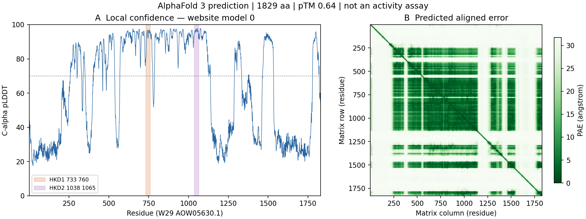

# W29 SPO14-like 蛋白的 AlphaFold 3 网页结果

**网页版预测已完成，完整结果已下载，五份模型已核验。** 目标为 **YALI1E22633g（来源写作 YALI1_E22633g；旧 ID YALI0E18898g；文献名称 SPO14）**，对应 W29/CLIB89 的 **AOW05630.1**，1829 aa。已知证据支持其为 SPO14-like 磷脂酶 D 候选；PE 底物活性未直接表征。本次新增的是 **AlphaFold 预测**，不是酶活实验。

结果于 2026-09-14 获取：[AlphaFold Server 任务](https://alphafoldserver.com/fold/4ba24dc5f1f66c93)。仅提交一次、seed=1、单蛋白一拷贝，无配体/修饰。下载请求明确 `useStructureTemplate=true`；未记录具体模板截止日，不将 FAQ 默认值当成该次运行的实测配置。请求中的 `version=3` 是格式版本；坐标文件实际导出的软件标识为 `AlphaFold-beta-20231127 (baa66c34-2f7c-455c-9d77-f686cf8a9237 @ 2026-09-14 12:50:28)`，不把其中时间解释为已知时区的后台开始/结束时间。

## 本次实际核验

请求序列与五份坐标的 1829 个 Cα 残基序列均与固定 W29 FASTA 完全一致。完整序列 SHA-256 为 `4330de351517f9142cef7f2d0213894a4aa48e5050915096fe74790e736415ea`，没有用不同菌株的序列代替。下载 ZIP、输入文件、代码及每份使用条目的完整指纹和运行时版本见 [获取记录](AF3_RETRIEVAL.json) 与 [质量数据](AF3_QUALITY.json)。原始 ZIP 保留，五份坐标已单独保存。

五个样本的导出 pTM 都是 **0.64**，ranking_score 都是 **0.84**；ipTM 为 null（单链）。本报告以网页显示的模型 0 为例；导出值已舍入且同分，不能据此确定更细排名。ranking_score 不是“84%正确率”。五个同一任务样本的相近评分也不构成独立实验验证。

| 模型 0 指标 | 导出/重算值 | 含义与口径 |
|---|---:|---|
| 全长平均 Cα pLDDT | **62.86** | 1829 个残基等权；全长质量不均匀 |
| Cα pLDDT < 70 | **901/1829（49.26%）** | 不将这些区段视为可靠的精细构象 |
| Cα pLDDT < 50 | **733/1829（40.08%）** | 很低置信度，不等于已实验确认的无序区 |
| HKD1，733–760 | **93.78** | 预先指定的 28 aa 窗口，Cα pLDDT 均值 |
| HKD2，1038–1065 | **95.92** | 预先指定的 28 aa 窗口，Cα pLDDT 均值 |
| HKD1/HKD2 内部 PAE | **2.11 / 1.62 Å** | 各 28×28 块均值，含对角线 |
| 两 HKD 窗口间 PAE | **2.63 / 2.15 Å** | 分别为矩阵行 HKD1/列 HKD2 及相反方向，各 784 项均值 |

五个模型的全长 Cα pLDDT 均值为 62.73–63.01；两个 HKD 窗口分别为 93.62–93.86、95.80–96.00。以下是模型 0 的候选催化位点；这些位置来自既有序列比对/注释，尚无该蛋白的定点突变验证。

| 位点 | H738 | K740 | D745 | H1043 | K1045 | D1050 |
|---|---:|---:|---:|---:|---:|---:|
| Cα pLDDT | 93.67 | 95.86 | 92.39 | 95.94 | 95.83 | 95.75 |

图中左侧为逐残基 Cα pLDDT，阴影为两个 HKD 窗口；右侧为未经对称化的原始 PAE 矩阵。低 PAE 表示相对位置的预测误差估计较低。两个局部窗口置信度高，并不等于整个蛋白、完整催化结构域或活性构象均已确认。pTM、pLDDT 与 PAE 的指标含义依据 [DeepMind 官方 AF3 输出说明](https://github.com/google-deepmind/alphafold3/blob/main/docs/output.md)（2026-09-14 查阅）；本次软件身份仍以实际导出文件为准。

AF3 提供逐原子 pLDDT。本报告统一用 CIF 的 Cα 值计算逐残基统计，未把逐原子平均值混称逐残基平均值：模型 0 的全原子 CIF 均值是 60.00474，JSON 均值是 60.00660。两种导出表示存在小幅差异，五份模型的逐原子最大绝对差均约 0.10。首次分析预设差异不超过 0.011 的一致性断言失败；检查原始数值后改为分别保存两套统计和实际差值，未改输入或生物学判定阈值，也未假定差异原因。最终分析通过序列、残基编号、原子数量、PAE 维度及数值有限性检查。

## 对 PE 水解问题的结论

**可以说：候选 HKD 位点附近的预测结构具有较高局部置信度，可用于后续针对性分析。** 结合此前同源和注释证据，目标继续保留为“基于 AlphaFold 预测的功能候选：SPO14-like 磷脂酶 D”；本轮没有进行参考结构叠合、底物结合或酶活检验，不能把局部置信度当成新的底物特异性证据。

**仍不能说：该蛋白已经被证实水解 PE、释放游离乙醇胺，或能在 SD-Leu 中提供净乙醇胺通量。** 条件性的候选反应是 PE + H₂O → PA + 游离乙醇胺；确认这一具体功能需要目标蛋白对 PE 的直接底物/产物证据。此前文献的磷脂组成变化没有测定游离乙醇胺，也未提供该直接反应的酶学验证；见已审计的 [PE 水解核查](PE_HYDROLYSIS_REPORT.md)。这次无配体的结构预测不能补上该证据缺口。

本轮仅验收这一网页任务的五份样本，未新增预测、对接、结构搜索或代谢求解。模型/GPR 未改。原 HPCC 任务 28375032 未取消或变更，本轮未重新检查其排队状态。

独立核验见 [AF3 来源审计](AF3_SOURCE_AUDIT.md)；审计覆盖与未决项以该记录为准。
