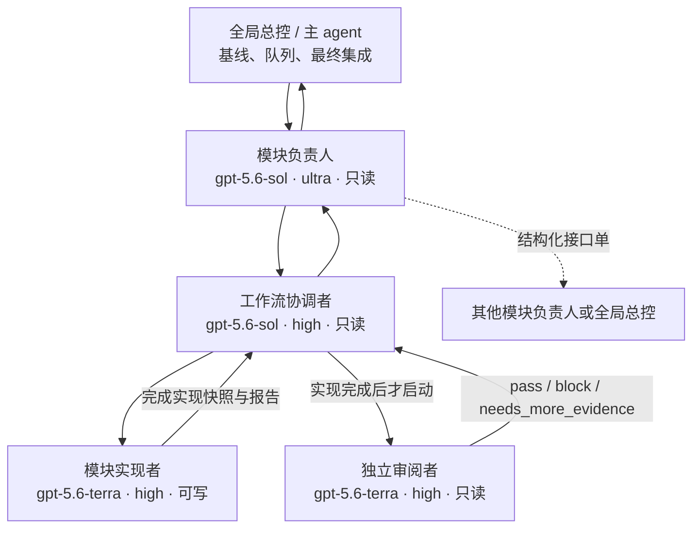
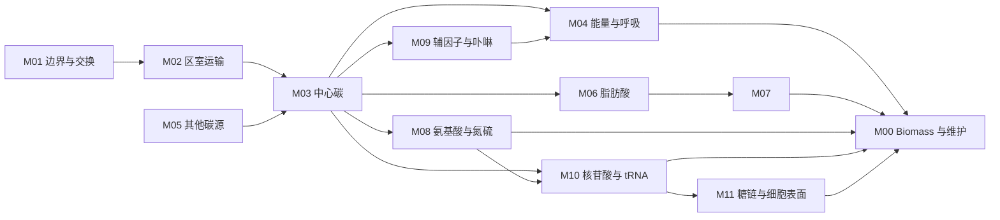
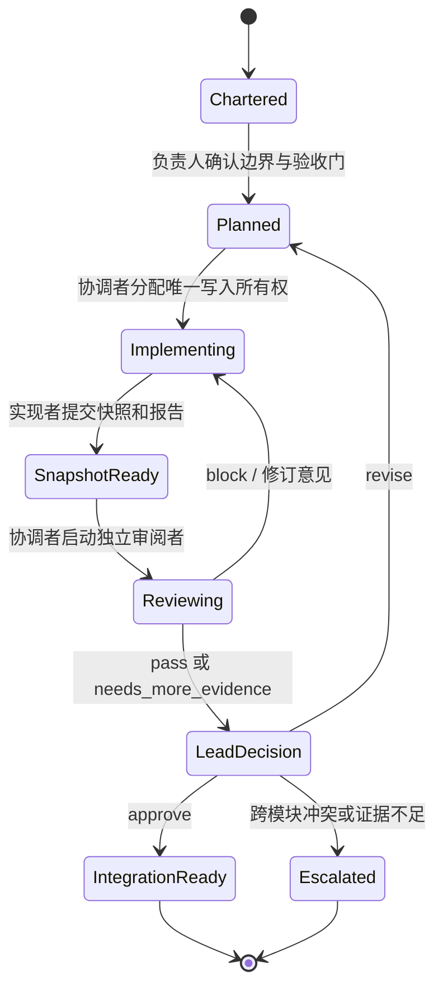

# M00–M11 多智能体模块工作流

## 1. 目标与不可变约束

这套工作流把 iYali26 的模块审计和改进组织为一个可追踪的多智能体流程。它管理的是“工作依赖”，不是把真实代谢网络强行改成无环网络。

[`config/module-agent-workflow.json`](../config/module-agent-workflow.json) 是模块依赖、角色固定档位、交接字段和完成门的单一事实来源；本文负责解释它，不另建第二套可执行配置。JSON Schema 和验证程序会同时校验 DAG、角色 TOML、工作流指纹及当前 `model.xml` 指纹。

全流程遵守以下约束：

- 一次只运行一个完整模块团队；模块按依赖分批推进。
- 模块负责人负责科学判断，协调者负责拆分与汇总，只有实现者可以写入工作区。
- 实现者与审阅者必须是不同 agent；审阅必须发生在实现快照完成之后。
- 同一路径同一时间只有一个写入者。任何并行产生的未知改动都要保留并上报，不能回退或覆盖。
- 默认模式是只读清点；只有明确的用户修改请求、边界清楚的任务包、基线 SHA、独占文件所有权和验收门全部存在时，才能启动实现者。
- `model.xml` 不得手工编辑。需要更新标准模型时，只能由正常的 `data/iyali26.xml -> model.xml` 管线生成，并记录输入、输出及 SHA-256。
- 仓库 `AGENTS.md` 中的 SD-Leu essentiality false-negative 人类门控流程优先于本文的通用模块流程。

## 2. 团队层级



| 角色 | 自定义 agent | 模型与档位 | 权限 | 主要责任 |
| --- | --- | --- | --- | --- |
| 模块负责人 | `metabolic-module-lead` | `gpt-5.6-sol / ultra` | 只读 | 模块边界、科学推理、跨模块接口、最终模块判断 |
| 工作流协调者 | `metabolic-workflow-coordinator` | `gpt-5.6-sol / high` | 只读 | 拆任务、分配文件所有权、串行安排实现与审阅、汇总报告 |
| 模块实现者 | `metabolic-module-implementer` | `gpt-5.6-terra / high` | 工作区可写 | 修改获授权的 curated data、管线代码和测试，生成可复现证据 |
| 独立审阅者 | `metabolic-module-reviewer` | `gpt-5.6-terra / high` | 只读 | 在实现完成后审查实际差异、科学正确性和回归风险，不代写修复 |

模块负责人的 `approve` 只表示“可交给全局总控集成”，不等于合并、发布或人类批准。

## 3. M00–M11 模块边界

| 模块 | 名称 | 主要范围 | 典型输出接口 |
| --- | --- | --- | --- |
| M00 | Biomass 与维护 | biomass 组成、GAM/NGAM、最终整合验收 | 全模型生长与组成约束 |
| M01 | 边界与交换 | exchange、sink、demand、培养基边界 | 可用底物与可排产物集合 |
| M02 | 区室运输 | 胞外、胞质、线粒体、过氧化物酶体等运输 | 跨区室可达性与方向 |
| M03 | 中心碳代谢 | 糖酵解、PPP、TCA、乙酰辅酶 A 前体 | 碳骨架、还原力和中心前体 |
| M04 | 能量与呼吸 | 氧化磷酸化、呼吸电子传递、ATP 供应和氧化还原耦联 | ATP 与呼吸容量接口 |
| M05 | 其他碳源 | 非主碳源的摄取后同化与接入点 | 进入中心碳网络的通量入口 |
| M06 | 脂肪酸 | 脂肪酸合成、延长、不饱和化与降解 | acyl/acyl-CoA 物种及能量需求 |
| M07 | 复合脂质 | 甘油脂、磷脂、甾醇相关复合脂质 | 膜脂和 biomass 脂质组分 |
| M08 | 氨基酸与氮硫 | 氮硫同化、氨基酸合成与降解 | 蛋白质前体和含氮/含硫接口 |
| M09 | 辅因子与卟啉 | 辅酶、辅基、卟啉和 heme 的生成与缺失耦联风险 | 酶反应和呼吸模块所需辅因子 |
| M10 | 核苷酸与 tRNA | 嘌呤、嘧啶、核苷酸糖活化及 tRNA charging | DNA/RNA 前体、activated sugar 与 charged tRNA |
| M11 | 糖链与细胞表面 | 糖基化前体、细胞壁/表面聚合物 | biomass 表面和糖链组分 |

边界有争议时，先由负责人建立接口单，不允许两个模块同时修改同一反应或代谢物来“各自解决”。

## 4. 调度 DAG



这是验收证据和接口稳定顺序。真实代谢物可能在模块间形成反馈；反馈通过接口单回到上游，不在调度图中增加循环边。

推荐批次：

| 批次 | 模块 | 进入下一批的条件 |
| --- | --- | --- |
| W1 | M01、M05 | 边界和其他碳源入口各自完成 |
| W2 | M02 | 区室运输接口完成，并吸收 M01 的边界契约 |
| W3 | M03 | 中心前体、碳收支和接入点通过审阅 |
| W4 | M06、M08、M09 | 脂肪酸、氨基酸/氮硫、辅因子/卟啉接口各自稳定 |
| W5 | M04、M07、M10 | 能量/呼吸、复合脂质和核苷酸/tRNA 输出通过审阅 |
| W6 | M11 | 糖链与细胞表面组分通过审阅 |
| W7 | M00 | 对全部已批准依赖执行最终 biomass、维护和全局回归 |

“同一批”表示逻辑上可并行，并不表示在一个 5 席位会话里同时启动多个写入团队。全局总控按风险、依赖和文件重叠情况逐个模块派发。

## 5. 五席位预算

配置为一个主席位加四个模块角色席位，总上限五席位：

1. 全局总控；
2. 当前模块负责人；
3. 当前工作流协调者；
4. 模块实现者；
5. 独立审阅者。

四个模块角色具有独立的逻辑席位，但实现者完成后协调者才启动审阅者，所以两个 Terra 角色绝不同时执行。审阅阶段通常只有四个 agent 仍在活跃运行；暂时释放的执行容量不能拿来提前启动下一个模块的写入者。负责人确需跨模块咨询时，只能派发短时只读任务，并保证活跃总数不超过五。

## 6. 单模块状态机



每次返工都保留 `I1 -> R1 -> I2 -> R2` 链。审阅者不修代码，实现者不审阅自己；工作区变化后，旧审阅结论自动失效。

## 7. 结构化交接

### 7.1 模块任务书

```yaml
module_id: M06
workflow_id: "iyali26-metabolic-module-agents-v1"
workflow_sha256: "<control-plane sha256>"
objective: "验证并完善脂肪酸模块的受控范围"
scope: "<resolved reaction/metabolite/gene set>"
base_commit: "<git commit>"
baseline_model_sha256: "<sha256>"
owned_paths:
  - "<exact path>"
upstream_contracts:
  - from_module: M03
    interface: "acetyl-CoA / NADPH precursor contract"
downstream_contracts:
  - to_module: M07
    interface: "acyl-CoA species contract"
acceptance_gates:
  - "focused tests pass"
  - "mass and charge checks pass"
  - "no unapproved cross-module change"
out_of_scope:
  - "biomass retuning"
write_activation:
  explicit_user_change_request: true
  bounded_work_packet: true
  baseline_model_sha256: true
  exclusive_file_ownership: true
  acceptance_gates: true
```

没有 `base_commit`、`baseline_model_sha256`、精确文件所有权或验收门时，负责人和协调者都应停止派发。

### 7.2 跨模块接口单

```yaml
workflow_id: "iyali26-metabolic-module-agents-v1"
workflow_sha256: "<control-plane sha256>"
baseline_model_sha256: "<sha256>"
from_module: M06
to_module: M07
dependency_kind: "material | precursor | energy | biosynthetic | biological_advisory"
finding: "<one falsifiable statement>"
evidence_status: "verified | provisional | contradicted"
requested_action: "<bounded request>"
blocking: true
unresolved_questions: []
# 可选追踪字段：handoff_id、base_commit、evidence、affected_entities、owner、status
```

跨模块沟通以接口单为准。自由文本可以解释背景，但不能替代基线、证据、责任人和状态。

### 7.3 实现报告

```yaml
module_id: M06
workflow_id: "iyali26-metabolic-module-agents-v1"
workflow_sha256: "<control-plane sha256>"
implementation_complete: true
base_commit: "<git commit>"
baseline_model_sha256: "<sha256>"
objective: "<objective>"
scope: "<resolved scope>"
head_or_diff_fingerprint: "<commit or diff sha256>"
owned_paths: []
files_changed: []
model_entities_changed:
  reactions: []
  metabolites: []
  genes: []
pipeline_inputs_changed: []
commands_run: []
tests:
  passed: []
  failed: []
checks_not_run: []
model_output_sha256: "<sha256 or null>"
cross_module_handoffs: []
unresolved_risks: []
reviewer_notes: []
```

### 7.4 独立审阅报告

```yaml
module_id: M06
workflow_id: "iyali26-metabolic-module-agents-v1"
workflow_sha256: "<control-plane sha256>"
reviewed_base: "<git commit>"
reviewed_snapshot: "<same implementation fingerprint>"
baseline_model_sha256: "<sha256>"
objective: "<objective>"
scope: "<resolved scope>"
files_changed: []
model_entities_changed: {}
tests: {}
reviewer_independent: true
findings:
  - severity: "blocker | high | medium | low"
    location: "<file/entity>"
    evidence: "<reproducible evidence>"
    impact: "<behavioral or biological impact>"
    required_action: "<bounded correction>"
cross_module_handoffs: []
unresolved_risks: []
unresolved_questions: []
reviewer_verdict: "pass | block | needs_more_evidence"
recommendation: "approve | revise | escalate"
```

### 7.5 协调者提交给负责人的报告

```yaml
module_id: M06
workflow_id: "iyali26-metabolic-module-agents-v1"
workflow_sha256: "<control-plane sha256>"
base_commit: "<git commit>"
baseline_model_sha256: "<sha256>"
objective: "<objective>"
scope: "<resolved scope>"
implementation_snapshots: []
files_changed: []
model_entities_changed: {}
tests: []
reviewer_identity: "<agent/thread>"
review_findings: []
reviewer_verdict: "pass | block | needs_more_evidence"
cross_module_handoffs: []
unresolved_risks: []
recommendation: "approve | revise | escalate"
evidence_paths: []
```

## 8. 写入、生成与验收规则

- 协调者必须按精确路径分配所有权，不能只写“修改脂质相关文件”。
- 模块归属是概念性提示，SBML subsystem/group 也不是权威所有权。实际目标必须在任务包中解析；无法映射的目标交给全局总控，不擅自归类。
- 实现者开始前检查工作区；发现不属于任务的改动时保留原状，并在报告中记录。
- 通常应修改 curated tables、管线函数和测试。不能通过直接修改 SBML 输出掩盖缺少的管线来源。
- `data/iyali26.xml` 是不可变的管线起始模型；`model.xml` 是标准输出。只有被任务书授权的正常构建可以重新生成标准输出。
- 任何声称“模型已更新”的报告都要给出基线模型 SHA、输出模型 SHA、实体变化和生成命令。
- 实现者至少运行任务书指定的聚焦测试；涉及反应或代谢物时还要按风险检查质量/电荷、区室、方向和能量循环；涉及 GPR 时要核对基因身份和证据层级。
- 审阅者必须核对实际差异和快照指纹。实现后又发生写入时，必须重新审阅。
- 只有负责人确认审阅通过且接口风险已处理后，包才进入全局集成；全局总控仍需运行合并后的回归。

## 9. Essentiality FN 固定流程优先

本文不替代仓库 `AGENTS.md` 的 essentiality false-negative 流程。只要任务属于 SD-Leu essentiality FN，或用户发出下列命令之一，通用模块团队必须停止并返回 `special_workflow_required`：

- `审查下一批 essentiality FN`
- `接受 EGC-xxxxxxxxxxxx`
- `拒绝 EGC-xxxxxxxxxxxx`
- `延后 EGC-xxxxxxxxxxxx`

这类任务必须遵循固定顺序：新鲜模拟与指纹校验；三个独立的 Yarrowia 文献 reviewer；随后一个 evidence skeptic；再由人类对准确 case ID 明确接受、拒绝或延后；只有已明确接受的 case 才能交给专用 `essentiality-patch-builder`。模块负责人、协调者、通用实现者和通用审阅者都无权创建或推断 `accepted` 状态。

## 10. 推荐启动方式

全局总控每次只提交一个完整任务书，例如：

```text
请使用 metabolic-module-lead 负责 M06。以当前 commit 和 model.xml SHA-256
为基线，先确认上下游接口，再让 metabolic-workflow-coordinator 串行安排
metabolic-module-implementer 和 metabolic-module-reviewer。实现与审阅不得并行；
等待独立审阅后，以本文结构化格式返回模块决策和跨模块接口单。
```

进入下一模块前，全局总控更新基线 commit、模型 SHA、已解决接口单和可写路径清单。旧基线上的结论不能自动沿用到新基线。

控制平面可用下列命令校验；输出会给出派生波次、角色固定档位、工作流 SHA 和当前基线模型 SHA：

```bash
python -m scripts.gem_annotate.module_workflow
```
